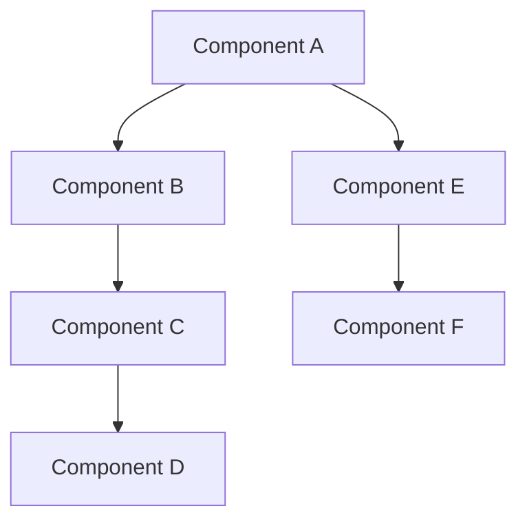
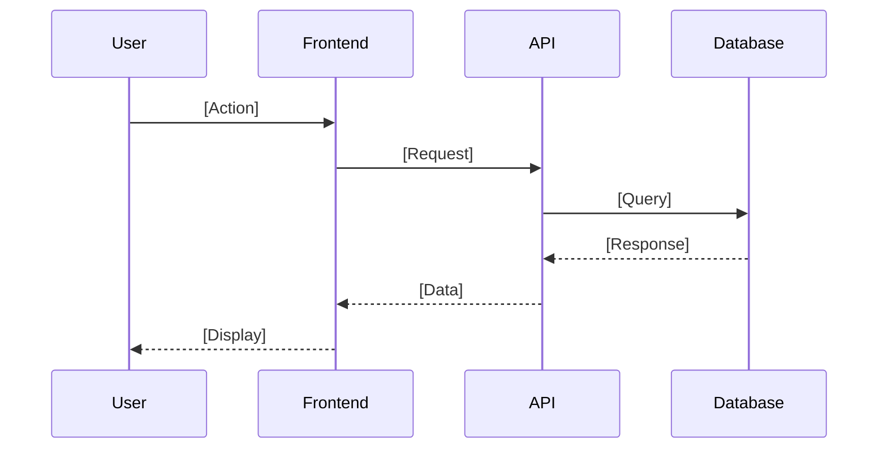

# Planner Skill

This skill guides the planning phase of greenfield projects. It generates specification documents when they do not exist or augments existing documents that are incomplete.

## What it is

A structured approach to understanding what needs to be built and ensuring that complete specification documents exist before writing code.

## What it does

- Assesses existing documentation for completeness.
- Conducts discovery to clarify scope, requirements, and constraints.
- Generates missing documents: `Requirements.md`, `Design.md`, `Tasks.md`.
- Augments incomplete documents to fill gaps.
- Ensures alignment between developer intent and agent understanding.

## Why it is important

Planning prevents wasted effort. AI agents can generate code quickly, but generating the wrong code wastes time and introduces risk. This skill ensures the agent fully understands the goal before execution and documents that understanding in a standard format that any harness can use.

## Scope

- Greenfield projects only.
- For brownfield projects, use the brownfield workflow and audit-based processes instead of this planner skill.

## Process

### Phase 1: Document Assessment

Before discovery, check what already exists.

**Document locations:**

- `README.md`: root only.
- `AGENTS.md`: root only.
- `Requirements.md`: root first, then `/docs`.
- `Design.md`: root first, then `/docs`.
- `Tasks.md`: root first, then `/docs`.

If spec documents exist in both root and `/docs`, prefer the root version. Do not move existing documents.

For each spec document found (`Requirements.md`, `Design.md`, `Tasks.md`), assess completeness against the templates:

- **Missing**: Document does not exist.
- **Incomplete**: Document exists but required sections are missing or contain placeholder content.
- **Complete**: Document exists with all required sections filled with real content.

**Assessment output:**

- List which documents are missing, incomplete, or complete.
- For incomplete documents, identify specific gaps.
- Present the assessment to the developer before proceeding.

### Phase 2: Discovery

Conduct discovery proportional to what is needed.

- **All docs complete**: Minimal discovery. Verify understanding and confirm no changes are needed.
- **Some docs incomplete**: Focused discovery. Gather information only for the gaps.
- **No docs exist**: Full discovery. Clarify scope, audience, constraints, success criteria, and tech preferences.

Steps:

1. Ask clarifying questions based on identified gaps.
2. Summarize understanding back to the developer.
3. Wait for explicit approval before generating or augmenting documents.

### Phase 3: Document Generation and Augmentation

- If a document is missing: generate it from scratch using the templates below.
- If a document is incomplete: augment existing content to fill gaps while preserving what is already present.
- If a document is complete: no changes are needed.

Generate or update documents in this order:

1. `Requirements.md`
2. `Design.md`
3. `Tasks.md`

Each document informs the next, so order matters.

After all three are complete, proceed to create or update `AGENTS.md` per `system-prompts/agents-md-instructions.md`.

---

## Document Templates

The following templates define the required structure for documents generated or augmented by this skill.

### Requirements.md Template

Persona: Technical Product Manager  
Purpose: Define what the project must do with explicit acceptance criteria.

Rules:

- No emojis.
- Do not use code blocks for simple lists of tech, libraries, or tools.
- Reserve code blocks only for actual code, configuration, or commands.
- Use clear, atomic features with explicit acceptance criteria.

Structure:

```markdown
# Project Requirements

## 1. Project Overview
- **Objective**: [What this project accomplishes]
- **Target Audience**: [Who will use this]

## 2. Tech Stack & Constraints
- **Frontend**: [Framework, libraries]
- **Backend**: [Runtime, framework, database]
- **Infrastructure**: [Hosting, CI/CD]
- **Tools**: [Build tools, testing frameworks]

## 3. Core Features
- **[Feature Name]**: [Technical description of what it does]
  - *Acceptance Criteria*:
    - [ ] [Specific, testable criterion]
    - [ ] [Another criterion]

- **[Feature Name]**: [Technical description]
  - *Acceptance Criteria*:
    - [ ] ...

## 4. User Experience (UX) Flow
- Step 1: [User action] -> [System response]
- Step 2: ...
- Step 3: ...

## 5. Non-Functional Requirements
- **Performance**: [Response times, load capacity]
- **Security**: [Auth, data protection requirements]
- **Scalability**: [Growth expectations]
```

### Design.md Template

Persona: Lead Software Architect  
Purpose: Define how the project will be structured.

Rules:

- No emojis.
- Exactly two Mermaid diagrams are required:
  1. Architecture diagram (`graph TD`) with at least six nodes.
  2. User flow diagram (`sequenceDiagram`) with at least three participants.
- Use code blocks only for diagrams and actual code, not prose.
- All sections must have real, project-specific content (no placeholders).

Structure:

```markdown
# System Design

## 1. Design Philosophy
- **Aesthetic Direction**: [Chosen style with rationale]
- **Typography**: [Specific font choices]
- **Color Palette**:
  - --primary: #[hex]
  - --secondary: #[hex]
  - --accent: #[hex]
  - --background: #[hex]
  - --text: #[hex]
- **Key Visual Elements**: [2-3 distinctive design choices]

## 2. High-Level Architecture
- **Pattern**: [SPA, microservices, monolith, etc.]
- **Description**: [How components connect and communicate]

### Architecture Diagram


## 3. User Flow Architecture
- **Critical Path**: [Primary user journey]
- **Key Interactions**: [Important system touchpoints]

### User Flow Diagram


## 4. File Structure
[Project tree with explanation of each important directory]

## 5. Data Models & TypeScript Interfaces
```typescript
interface [Entity] {
  id: string;
  // fields...
}
```

## 6. Component Design
[Major UI components, their props, and responsibilities]

## 7. API Design
[Endpoints with method, path, request/response shapes, error responses]
```

### Tasks.md Template

Persona: Senior Engineering Manager  
Purpose: Break down implementation into atomic, sequential tasks.

Rules:

- No emojis.
- Tasks must be atomic (one clear action).
- Tasks must be sequential with explicit dependencies.
- Every task must include all four fields: Description, Dependencies, Files, Verification.
- Use code blocks only for specific commands, not prose.

Required phases:

1. Phase 1: Project Setup.
2. Phase 2: Backend Core.
3. Phase 3: Frontend Core.
4. Phase 4: Integration.
5. Phase 5: Polish and Testing.

Structure:

```markdown
# Implementation Tasks

## Phase 1: Project Setup

- [ ] **Task 1.1**: [Title]
  - **Description**: [2-3 sentences, very specific about what to do]
  - **Dependencies**: None
  - **Files**: [Explicit file paths that will be created/modified]
  - **Verification**: [Specific command or check to confirm completion]

- [ ] **Task 1.2**: [Title]
  - **Description**: [What to do]
  - **Dependencies**: 1.1
  - **Files**: [File paths]
  - **Verification**: [How to verify]

## Phase 2: Backend Core

- [ ] **Task 2.1**: [Title]
  - **Description**: ...
  - **Dependencies**: 1.1, 1.2
  - **Files**: ...
  - **Verification**: ...

## Phase 3: Frontend Core

- [ ] **Task 3.1**: [Title]
  - **Description**: ...
  - **Dependencies**: 2.x
  - **Files**: ...
  - **Verification**: ...

## Phase 4: Integration

- [ ] **Task 4.1**: [Title]
  - **Description**: ...
  - **Dependencies**: 2.x, 3.x
  - **Files**: ...
  - **Verification**: ...

## Phase 5: Polish & Testing

- [ ] **Task 5.1**: [Title]
  - **Description**: ...
  - **Dependencies**: 4.x
  - **Files**: ...
  - **Verification**: ...
```

Verification examples:

- "Run `npm run dev` - dev server starts without errors."
- "Run `npm test` - all tests pass."
- "Navigate to /login - form renders correctly."
- "Submit form with invalid data - error message displays."